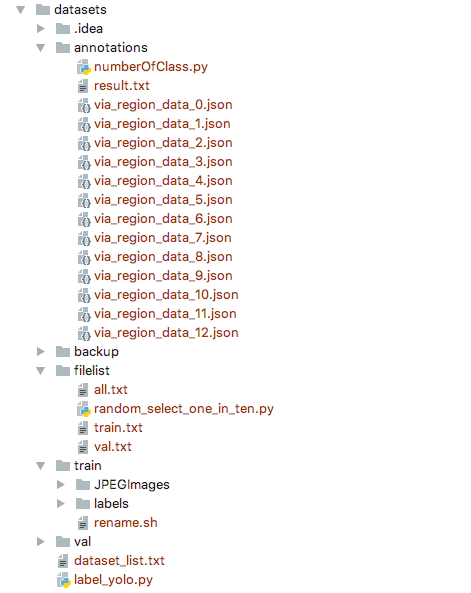

### 用yolov2/v3训练自己的数据集

官方源码见: [https://github.com/pjreddie/darknet](https://github.com/AlexeyAB/darknet)

AlexeyAB darknet 见: [https://github.com/AlexeyAB/darknet](https://github.com/AlexeyAB/darknet)

yolo原理详解见: [http://zhulf.com/2018/07/07/yolo.html](http://zhulf.com/2018/07/07/yolo.html)


训练自己数据集参考本文: [https://github.com/zhulf0804/about_yolov2v3_use](https://github.com/zhulf0804/about_yolov2v3_use) 


1. **数据集整合**

	这里是把所有的数据集整合到一个文件夹下，主要解决的问题的图片重名的问题.
	
	执行 `add_prefix.sh ` 脚本: `dirc是图片所在文件夹, init是所加前缀, obj是目标文件夹`

2. **把数据集转化成yolo需要的格式**

	标注工具：[http://www.robots.ox.ac.uk/%7Evgg/software/via/via.html](http://www.robots.ox.ac.uk/%7Evgg/software/via/via.html),可下载离线版
	
	在标注完数据集之后，就可以开始做yolo训练的目录了.结构如下图所示：
	
	
	
	**annotations**目录放置的是我们的刚刚标注的数据集(.json)
	
	**filelist**目录是运行程序`label_yolo.py`生成的,train.txt是训练用到的图片列表
	
	**train/JPEGImages**目录放置的是我们原始数据集(.jpg)
	
	**train/labels**里面存放的是每个图片的注释，一个图片一个.txt文件, 也是由`label_yolo.py`程序生成的 
	**val**目录结构同**train**一样，训练时不用考虑
	
	**label_yolo.py**生成**train/labels**目录下的文件，生成filelist/train.txt文件
	
	**dataset_list.txt**文件结构如下，它存放的是需要训练的类
	
	```python
	# id, object
	# id根据后面配置文件来选取的
	0, object1
	1, object2
	...
	```
	
	在理解了目录结构之后，我们需要做的是建立如图所示的目录结构，并把标记好的.json数据放到**annotations**目录下，把数据集(.jpg)放入到**train/JPEGImages/**,然后运行`label_yolo.py`.
	
	**label_yolo在运行之前需要根据需要更改一些参数，程序不长，可以看懂程序后再修改运行**

2. 统一图片名字的后缀**[可选]**

	执行脚本: `rename_post_fix.sh` 
	
3. 统计每一类的数量**[可选]**

	执行脚本: `numberOfClass.py `

4. 增强数据集-旋转**[可选]**

	对数据集及对应label的位置进行90°, 180°, 270°旋转: 详情参见`rotate.py` 

5. 将数据集分为训练集和测试集

   方法很多，这里采用了最简单的算法: 每10个样本选取一个样本作为测试集，
   
   执行脚本: `random_select_one_in_ten.py`
	
6. **修改模型的配置文件**

	+ 在**cfg**目录下添加dataset_name.data，内容如下：
	
	```python
	classes=3
	train = ./datasets/filelist/train.txt
	valid = ./datasets/filelist/val.txt
	names = ./data/dataset_name.names
	backup = ./datasets/backup
	```
	
	+ 在**cfg**目录下，**如果用yolov3, 则执行下列操作**: copy yolov3-voc.cfg或yolov3.cfg to yolov3-dataset_name.cfg，然后修改yolov3-dataset_name.cfg，修改的参数参考[https://blog.csdn.net/lilai619/article/details/79695109](https://blog.csdn.net/lilai619/article/details/79695109);
	
		**如果用yolov2**, 找到region小节, 修改 **class** 为 自己数据集的数目,
		
		找到最后一个convolutional小节, 修改 **filters**为 (classes + 5) * 5, 这是因为每个 grid cell会使用5个anchor box来预测 bounding box, 每个bounding box包含(x, y , w, h, confidence, p1, p2, ..., p_class), 所有就是 (classes + 5) * 5. 
	
	+ 在**data**目录下添加dataset_name.names，内容如下, **这个文件和第1步中的dataset_list.txt有关**
	
	```python
	object1
	object2
	object3
	...
	```
	
	+ Makefile根据GPU,OPENCV的使用情况来修改 

3. **训练**

	```
	nohup ./darknet detector train cfg/dataset_name.data cfg/yolov3-dataset_name.cfg darknet53.conv.74 -gpus 0,1  > nohup.out 2>&1  &
	```

4. **测试**

	```
	./darknet detector test cfg/dataset_name.data cfg/yolov3-dataset_name.cfg yolov3-dataset_name_20000.weights data/test_big.jpg

	```
	

### 一些注意的问题

1. cudnn无法预测，关闭cudnn就可以预测。

	修改 cfg/yolov3-dataset_name.cfg, 将train注释, test打开
	
2. 如何控制训练次数，如何控制模型的保存。
	
	max_batches控制训练的次数
	
	模型的保存控制在examples/detector.c

3. 批量测试

	执行脚本 `run.sh`
	
5. 可视化边框

	将label框打印到原图像上:执行`vis.py`

4. 计算map和recall值

	官方源码没有提供计算map的功能, 需要下载AlexeyAB darknet 见: [https://github.com/AlexeyAB/darknet](https://github.com/AlexeyAB/darknet)
	
	执行命令: `./darknet detector map cfg/dataset_name.data cfg/yolov3-dataset_name.cfg datasets/backup/yolov3-dataset_name_50000.weights`
	
	输出类似于下面:
	
	```python
	class_id = 0, name = 0_d,   ap = 100.00 % 
	class_id = 1, name = 1_d, 	 ap = 76.14 % 
	class_id = 2, name = 2_d, 	 ap = 100.00 % 
	class_id = 3, name = 3_d, 	 ap = 100.00 % 
	class_id = 4, name = 4_d, 	 ap = 0.00 % 
	class_id = 5, name = 5_d, 	 ap = 100.00 % 
	class_id = 6, name = 6_d, 	 ap = 100.00 % 
	class_id = 7, name = 7_d, 	 ap = 100.00 % 
	class_id = 8, name = 8_d, 	 ap = 89.42 % 
	class_id = 9, name = 9_d, 	 ap = 100.00 % 
	class_id = 10, name = 10_d, 	 ap = 96.51 % 
	class_id = 11, name = 11_d, 	 ap = 97.20 % 
	class_id = 12, name = 12_d, 	 ap = 100.00 % 
	class_id = 13, name = 13_d, 	 ap = 100.00 % 
	class_id = 14, name = 14_d, 	 ap = 77.98 % 
	class_id = 15, name = 15_d, 	 ap = 79.80 % 
	class_id = 16, name = 16_d, 	 ap = 100.00 % 
	class_id = 17, name = 17_d, 	 ap = 77.96 % 
	class_id = 18, name = 18_d, 	 ap = 100.00 % 
	class_id = 19, name = 19_d, 	 ap = 100.00 % 
	class_id = 20, name = 20_d, 	 ap = 100.00 % 
	class_id = 21, name = 21_d, 	 ap = 80.99 % 
	class_id = 22, name = 22_d, 	 ap = 100.00 % 
	class_id = 23, name = 23_d, 	 ap = 100.00 % 
	class_id = 24, name = 24_d, 	 ap = 59.85 % 
	class_id = 25, name = 25_d, 	 ap = 62.64 % 
	class_id = 26, name = 26_d, 	 ap = 75.94 % 
	class_id = 27, name = 27_d, 	 ap = 100.00 % 
	class_id = 28, name = 28_d, 	 ap = 96.97 % 
	class_id = 29, name = 29_d, 	 ap = 80.75 % 
	 
	 for thresh = 0.25, precision = 0.80, recall = 0.92, F1-score = 0.85 
	 for thresh = 0.25, TP = 363, FP = 93, FN = 32, average IoU = 63.18 % 
	 mean average precision (mAP) = 0.884045, or 88.40 % 
	```